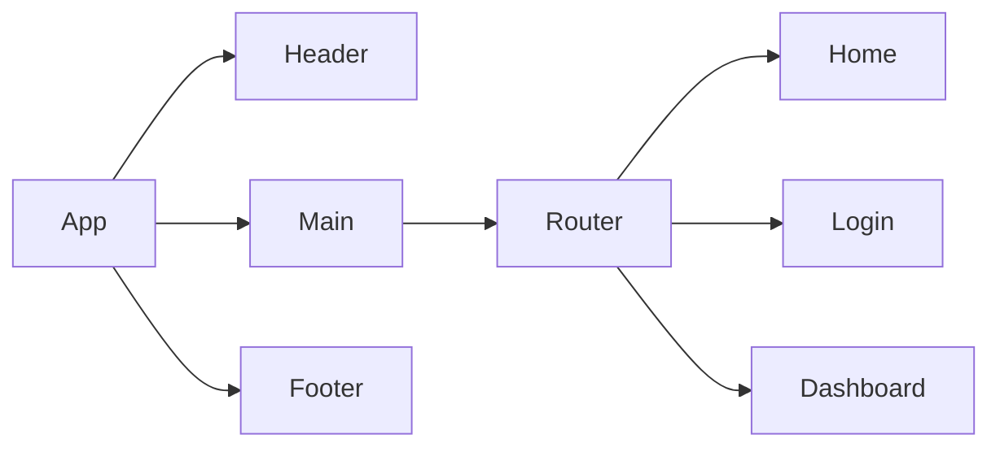

*A PRD (Product Requirements Document) is created before creating a product or feature and includes the planning required for developers to execute effectively. This document is usually prepared by Product Managers, read more [here](https://www.atlassian.com/agile/product-management/requirements)*

# Product Requirements Documentation

**Summary**
| Field | Detail |
|-------|--------|
| Project Name | {Cryptocurrency Converter}|
| Description | {convert between crypo and physical currency and be able to create a saved list to reference} |
| Developers | {[List of Developers](https://www.alphavantage.co/documentation/)} |
| Live Website | {Vercel?} |
| Repo | {[Link to git repository](https://github.com/kellyluuu/Cryptocurrency-Converter.git)} |

## Problem Being Solved and Target Market
calculate the value of any crypto and physical currency. Create a saved list of conversion user are interested in. 

## User Stories

List of stories users should experience when using your application.

- Users should be able to see the site on desktop and mobile
- User will see the default of conversion from BTC to USD
- User can change the currency to convert from and to 
- Users can create a saved list and go back to it with local storage
- User can delete items on saved list 

## Route Tables

For backend Applications you'll want to detail the different routes and types of your request your server can receive. There are three main things to define.

- The endpoint: [the URL to which the request must be made](https://www.alphavantage.co/query?function=CURRENCY_EXCHANGE_RATE&from_currency=USD&to_currency=JPY&apikey=demo)
- The method: the type of http method the request should be
- The response: json data

You should also include any additional notes on any special headers that may be used and so forth.

| Endpoint | Method | Response | Other |
| -------- | ------ | -------- | ----- |
| /item | GET | from_currency and to_currency |
| /item | POST | return currency code, name, exchange rate, and date|

## Component Architecture

You can use the [Mermaid Markdown Syntax](https://mermaid-js.github.io/mermaid/#/flowchart) to create a chart of how the parts of your frontend website relate to each other. Units should represent components of your page. The following is an example you may see in a Single Page Application like a React App.

## User Interface Mockups

