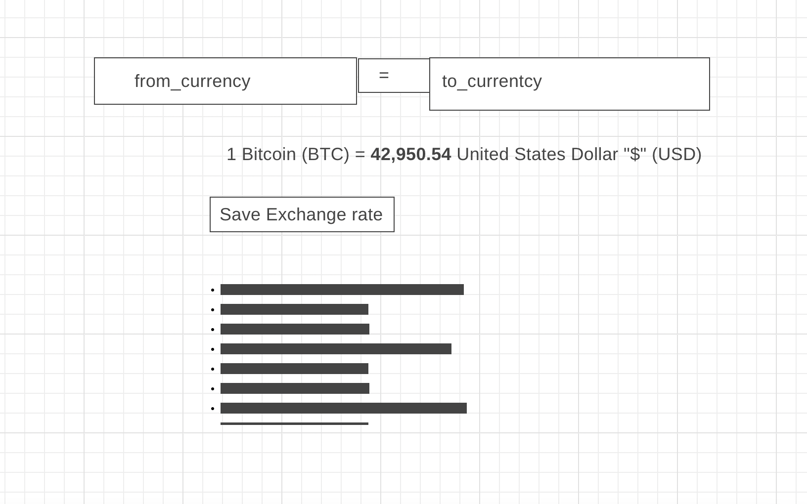

# Product Requirements Documentation

**Summary**
| Field | Detail |
|-------|--------|
| Project Name | {Cryptocurrency Converter}|
| Description | {convert between crypo and physical currency and be able to create a saved list to reference} |
| Developers | {[List of Developers](https://www.alphavantage.co/documentation/)} |
| Live Website | {Vercel?} |
| Repo | {[Link to git repository](https://github.com/kellyluuu/Cryptocurrency-Converter.git)} |

## Problem Being Solved and Target Market
calculate the value of any crypto and physical currency. Create a saved list of conversion user are interested in. 

## User Stories

List of stories users should experience when using your application.

- Users should be able to see the site on desktop and mobile
- User will see the default of conversion from BTC to USD
- User can change the currency to convert from and to 
- Users can create a saved list and go back to it with local storage
- User can delete items on saved list 

## User Interface Mockups

