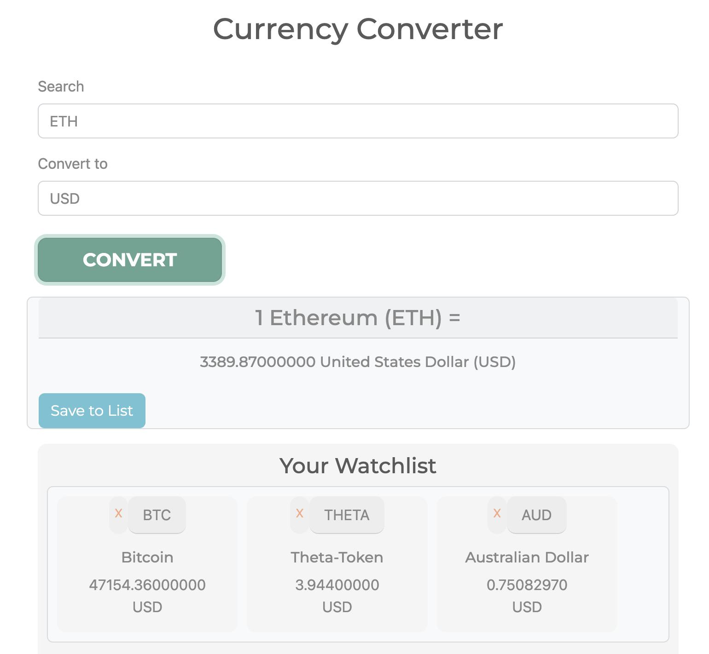

# Product Requirements Documentation

**Summary**
| Field | Detail |
|-------|--------|
| Project Name | Currency Converter|
| Description | Convert between crypo and physical currency and be able to create a saved list to reference |
| Developers | [Alpha Advantage](https://www.alphavantage.co/documentation/) |
| Live Website | [GitHub] (https://kellyluuu.github.io/Cryptocurrency-Converter/) |
| Repo | {[Link to git repository](https://github.com/kellyluuu/Cryptocurrency-Converter.git)} |

## Problem Being Solved and Target Market
calculate the value of any crypto and physical currency. User can create a favorit list of currency they are interested in. 

## User Stories

List of stories users should experience when using your application.

- User will see their saved list when laoding the page 
- Seach box will auto fill for them to click on the correct currency 
- Users can create a saved list and go back to it with local storage
- User can delete items on saved list 
- Users should be able to see the site on desktop and mobile

## User Interface Mockups

## future features
- choose a different api that have less issue with connecting 
- Add icon
- Less code

